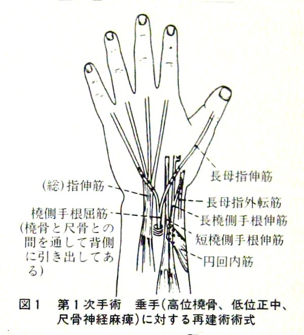
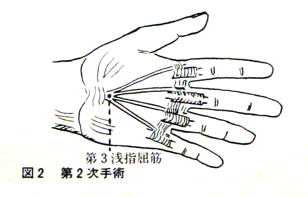
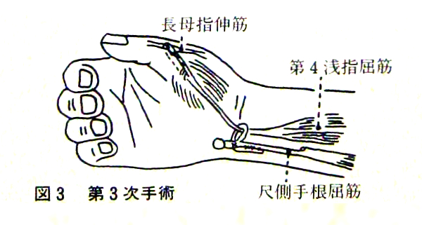

<!-- # Seto Island Sea -->

## Niirada Class, Oku High School

The bus route from Okayama Station to Mushiake via Saidaiji and Ushimado was mostly rural, and the regular route bus terminates at Mushiake, a fishing port on the Seto Inland Sea.

The only way to get to National Sanatorium Nagashima Aiseien is by private ferry from a small pier jutting out into Mushiake Bay. The boat is divided into two sections, the front part with the pilot's seat is for staff only, and the rear part is for patients and parties involved.

The boat heads for Nagashima, weaving through the many fish tanks and aquaculture rafts in the sea. Today, a bridge has been built and the islands are connected, but when I started school, it was a place that could only be reached by private ferry, and it was built for the very purpose of "total isolation and eradication".

There are two leprosy sanatoriums on Nagashima Island. Nagashima Aiseien, located on the east side of the island from the center, was opened in 1930.

Oku Komyoen, located at the western end of the island, was opened in 1938 and originally existed as Sotojima Sanatorium in Osaka City, which was directly hit by Typhoon Muroto in 1934, the disaster was so devastating that it even killed a large number of people. Reconstruction of the sanatorium in Osaka met with local opposition, so it was rebuilt under a different name on distant Nagashima Island, Okayama Prefecture.

For outsiders who just passing by and look, the island where the lepers live in exchange for their lives is undoubtedly breathtaking, filled with white sand, green pine trees and sky in the bay.

The gateway of Nagashima was the Funakoshi Pier. Once off the boat, the road splits into left and right, but all patients take the left road. A 500-meter walk along the pine-lined road by the sea leads to an ivy-covered treatment ward. Administrators refer to the area beyond as the "patient zone.

At a large camphor tree in front of the treatment ward, the road divides into two, with the road to the right running along the coast of the Seto Inland Sea. Soon you will see the large Public Hall building on your right. The road gradually climbs, then passes through a cut and follows the paved path on the hillside, Shodoshima Island appearing and disappearing in the distance through the branches of the pine trees. Soon we see the playground below us, which was once a valley and a landfill. Going straight down along the seashore is a shortcut to the back of the dormitory. The school was about 1.5 km from the camphor tree outside the clinic.

If you take the upper path of the playground instead of the one along the shore, you will come to the ruins of the elementary and junior high school buildings. Shortly after going down the hill, you will see the gate of the Niirada Classroom of Oku High School in front of you. To the right of the school building, there are three boys' dormitories, and to the left, up the hill away from the school gate, there is a girls' dormitory.

There were ten rooms to a boys' dormitory, up to three boys to each room, but those who came from the same sanatorium were assigned rooms to avoid sharing a room as much as possible.

Niirada Class of Oku High School was established in 1955, and only leprosy patients study there. It is a regular day school with a capacity of 30 students per class. I entered the school as the seventh generation, and at that time there were 80 boys and 35 girls.

Although it was a normal high school, students were required to choose an elective from the three subjects of Commerce, Agriculture, and Home Economics, perhaps as preparation for returning to society after graduation.

Classes were 50 minutes long, three hours in the morning, and the morning session ended at 12:20 p.m.

We ate lunch in the dormitory cafeteria, and classes usually ended with fourth period in the afternoon. The class schedule was set at 25 hours per week, which was not a tight schedule, and each student participated in club activities after school.

The late start time of 9:20 a.m. was due to the special circumstance of students being treated until then.

## Blue Blade

It was the first health check.

Since my seating order was the second, I undressed to the waist and waited for my turn in the next room. Soon, Mr. Arai came out of the office with a medical record in his hand.

"Please come in, Mr. Iha."

It was when I came to know Dr. Hashizume Chozo.

In 1993, I had the opportunity to join the banquet with Dr. Tsuyama Naoichi. He was a former professor of orthopedic surgery at the University of Tokyo; former president of the National Rehabilitation Center for the Disabled. As we drank happily together, Dr. Tsuyama quickly found the surgical scar on my hand and asked me, "Mr. Iha, who performed the surgery to you?"

"It was Mr. Hashizume Chozo, who worked at a leprosy sanatorium in Okayama."

"Wow, Mr. Hashizume. I see...Mr. Hashizume... his surgical skill is top class."

I was surprised to know that they knew each other. The encounter with the young, excellent doctor, whose name now rings out in the orthopedic surgery community, would change my life 180 degrees.

Two young surgeons had been assigned to Nagashima Aiseien in the spring.

Patients who had been in the sanatorium for a long time began to judge them as usual.

"Dr. Yutaka Yabe's skills are first rank. Dr. Hashizume is ordinary."

I asked them on what basis they made decision.

"Because Dr. Yabe is from the orthopedic department of Tokyo University, while Dr. Hashizume is from the orthopedic department of Shinshu University..."

Even on this small isolated island, they ranked doctors by the university they graduated from. I felt it was funny for the "world-class consciousness" of the patients. I also heard such a whisper.

"Dr. Hashizume recommends immediate surgery, so the patients are trying to avoid him."

Dr. Hashizume put his stethoscope on my chest and back and asked me about my condition.

"Mr. Iha, your hands and left leg are drooping. Could you take off your socks and let me take a look?"

He checked the function of my limbs for a while.

"It must be uncomfortable for you as it is. Especially your feet are starting to deform, besides the fact that your soles have no feeling, which will afflict you with perforations in the future."

The affliction had already begun. I had been suffering with my left foot since last fall. After a short walk or vigorous activity, a blood blister (hematoma) would soon develop and take a long time to heal.

"If you have orthopedic surgery, you will regain a lot of function in your limbs.

He was indeed true to the rumors. I let his words pass, thinking that he was recommending an operation right away.

"Could you give me some paper to write on?" He asked the head nurse.

When he received the paper, he suddenly began to explain the surgical procedure with illustrations. It went on for a long time.

Finally, Ms. Tanaka, the head nurse who was with us, became impatient and urged him, saying, "Dr. Hashizume, the students are waiting behind, so..."

"Oh, I see. Mr. Iha, please tell me your room number."

"It's number 18."

"I'll visit you there tonight."

As I was leaving the room, Dr. Hashizume called out to me

"Mr. Iha, if you have the surgery, you will surely be able to walk, and even playing catch won't be a dream anymore.

-----Run! Playing catch!

The words that had disappeared from me a long time ago had strangely stuck to my ears.

That evening, I was preparing for my Chinese literature class in my room. Since Mr. Arai had been called on in yesterday's class, I was sure next would be my turn, according to the seating order.

> The nation is broken, though mountains and rivers remain.  
> In cities in the Spring, the grass and trees grow deeply.  
> Sensing the moment, flowers shed tears.  
> Hating the separation, birds are fearful at heart.  
> The beacons have burnt continuously for three months.  
> A letter from home is worth ten-thousand pieces of gold.  
> My white hair is even scarcer from scratching.  
> And can barely hold a hairpin.
>
> [Chinese classical "du-fu-spring-view"](https://eastasiastudent.net/china/classical/du-fu-spring-view/)

"Good evening. Is this Mr. Iha's room?"

Dr. Hashizume's voice could be heard in the dormitory, which was rarely visited by outsiders except for teachers. He said, "Excuse me," and suddenly came into my room.

It was almost two kilometers over two hills from the doctor's house to the high school dormitory. I had the feeling of his visit, but it was unexpected that he would actually visit me that evening.

He opened the paper he had written on in front of me that morning. There was new writing in red ink. "I didn't have enough time this morning..."

Once again, he began to talk about the surgical procedure and the possibility of restoring function. I made appropriate responses now and then, trying not to be rude, but I was absent minded. His explanation went on for nearly two hours, until just before curfew.

The doctor's night visits continued for a month.

His enthusiasm was so unusual that my classmates made fun of us by saying, "Evening girlfriend of Iha.

His lecture covered many areas, and he repeated them in a very kind and detailed way to me, who had no medical knowledge. Sometimes he would even bring medical books and talk about "muscle structure," "brain and nerve command system," and even "bone function. It made me think that his lectures in medical schools would be just like that. With his repeated visits, I began to ask him rather rude questions.

"Doctor, you are so eager to recommend surgery, but do you have any examples here?"

"I have performed two operations on legs."

"Were they successful?"

"I'm sure they were, but the stitches have not been removed yet, and it will become clear in the post-operative rehabilitation training that follows."

I thought that was a very honest answer.

"What about the hands?"

"No, not yet. There has never been a case like yours with such severe impairment of dorsal wrist flexion and finger extension. If you are willing to agree, it would be my first case.

On this day, he also did not go so far as to get my consent. As we got to know each other, we began to talk about his school days to his life as a human being.

During our small talk, one word he casually mentioned stunned me.

"Times changes. Hansen's disease will become common. Limb deformities will become mere after-effects. Mr. Iha, you must improve the function of your limbs in preparation for your return to society."

"What? Return to society! Me?"

They were completely unexpected words.

I had already come to a conclusion about my life.

My classmates were always talking about their dreams after graduation, but I began to avoid joining them. I had calmly accepted such a dream of "returning to society" as a world irrelevant to me.

-----I came to high school and studied. I am happy. From now on, I will make the sanatorium my home for the rest of my life with those who suffer from the same diseases, "without greed or resentment. I should be able to find "my life" even in this sanatorium-----

I was reminded of this during the past two months in high school. The aftereffects of my limbs were the worst among the students, and even group life was not easy, forcing me to work hard to keep up with others.

"Doctor, who are you talking about?"

"It's you, of course."

"You're kidding me."

"Eh! Why?

"Do you think it is possible for me, even me, to return to society?"

"Obviously. It depends on how you feel. However, a minimum of bodily function is still required to return to society and live. "

My attitude, which had always been negative, changed too easily with this discussion.

## Modified Man

I had my first surgery in December 1963.

For the next five years, my days revolved around orthopedic surgery and rehabilitation. Twelve operations were performed, and Dr. Hashizume said, "The number of times the scalpel was used on one person and the record for sutures will probably never be broken."

Ten of them were concentrated in the last three years, which would have meant that I have an operation every four months.

Even counting the time spent in rehabilitation, I could not help but wonder, how dare my body be cut up so many times?

Sometimes I thought of myself as a modified man and I felt adorable staring at my surgical stitches. After the surgery, my body temperature rose to about 40 degrees for three days. By special arrangement, a desk was provided in my hospital room, and I waited for the fever to go down before going to school from there, as the operations were supposed to be compatible with schoolwork. My classmates used to tease me by saying, "Iha looks nice in his white cast and crutches.

The time for the first surgery of my foot was pressing. I was given orange pills.

"It is thirty minutes to your operation. This pill is a painkiller. Please go to the bathroom before the surgery."

Strangely, I felt calm. The day before, I had been told it would take about two hours, so I counted the hours after the surgery and thought I would be home before noon.

In the operating room, a doctor and four nurses dressed in light green gowns were waiting for me. I was very surprised when they put me on the operating table.

All the walls were covered with explanatory charts with illustrations, which seemed to be the order of the operation.

As the lumbar anesthesia was administered, I began to feel warmer and swollen from my waist to my toes.

The tourniquet on my left thigh was tightened with great force. A blood pressure cuff was placed on my outstretched and immobilized arm.

"BP’ 120 over 80. Pulse 85. All normal."

Dr. Hashizume silently disinfected my leg as the nurse lifted it.

"Surgery starts at 9:18 a.m."

Curiously, the nurse standing to my left covered her body as she leaned toward my face. Through her surgical gown I could feel her soft and warm breasts against my face. For a moment I was distracted by the swell of her breasts.

Just at that moment. There was a sharp pain in my right leg as if I had been stabbed with a burning fire chop stick.

-----Snap!-----

Something was pulled out with a sound. It happened so fast, there was no time to scream "Ouch! "

"Mr. Iha, I pulled out the tendon in your right leg. I will attach it to your left leg. It's beautiful. Would you like to see it?"

Dr. Hashizume showed me the saline soaked tendon that had just been severed. Its color was pale yellow, and it was kanpyo (dried gourd shavings) itself.

"Let's get started. Mr. Iha, how would you like to watch your own operation? It takes some courage, you know."

I had the feeling that Dr. Hashizume was testing me.

"Yes, I'd like to. Please."

Even now, as I remember, something very unusual was going to happen. I thought: How lucky I am to be able to watch the surgery being performed on myself. Dr. Hashizume called for a nurse.

"Remove the cover from his face. Lift up the pillow a little higher."

On the tray next to the operating table, scalpels and tweezers glistened.

As he gently inserted the scalpel vertically, the dermis, fat, and muscle separated as if a curtain were being opened.

Blood oozed from the capillaries. When the nurse quickly wiped it off with gauze, veins and white bone surrounded by thin fat were clearly visible.

Dr. Hashizume's voice rang out during the operation.

"(5) Alright." "(10) Done."

The charts with illustrations on the wall must have been a surgical procedure. The clock in the operating room showed past 10:30 a.m.

"Lift your toe as high as you can."

The doctor instructed the nurse. He connected my right tendon to my left leg. Then four screws, each about a centimeter long, were driven into each side of my ankle.

Just a few minutes ago, the tourniquet had cut into my thigh, and I was struck with tearing pain in my lower back. To distract myself from the excessive pain, I counted the tiles on the ceiling from right to left and then from bottom to top.

"One, two, three, four, five, six, seven -----"

"Blood pressure 150 over 100. Pulse 102. "

"The anesthetic is wearing off. Mr. Iha, can you hold on a little longer?"

When asked, "Can you hold out?" we rarely deny it by saying, "No, I can't."

"Yes, I'm okay. I can hold out..."

The ticking of the seconds sounded high and slow.

My face unconsciously swayed from side to side from the pain of the tourniquet on my thigh.

"Mr. Iha, I'm stitching up right now, so it's almost over."

Thirty minutes had passed since I was told it was almost over.

"Alright! It's done."

Dr. Hashizume's loud voice reached my ears.

I took a deep breath and looked at the clock on the wall, which read 11:22 a.m.

## Informed Consent

Suddenly, I was shaken out of my bed. The clock by my bedside read only a little after 5 a.m.

"Mr. Iha, I have a good idea. This is good. It will surely work. Yesterday, Assistant Professor Tsuge and Lecturer Tani from Okayama University gave me some advice. I was never really convinced, but this will work.

Dr. Hashizume stood next to my bed in his ordinary clothes with an excited face.

"It suddenly hit me while I was in the bathroom ... I just couldn't sit still and ran out of my house".

He had a notebook in his hand that had obviously been scribbled over many times. He spread it out in front of me and suddenly began to explain the surgical procedure.

Shortly thereafter, the surgery on my left hand began.

This surgical case was published in the academic journal "Surgical Treatment for Leprosy Patients with Limb Dysfunction", published in March 1976. He was recognized for his achievements as an orthopedic surgeon and received the 21st Leprosy Society of Japan Award at the 53rd Annual Meeting of the Leprosy Society of Japan in 1980.

"At least three surgeries are required on your left hand only. The interval between the surgeries will be about two months, and the main method is to transfer the tendon, which is a functional shift, and it means that the functions in your body that have been working under the command of your brain will be changed to another function. It changes the voluntary nerve commands themselves, so the body image that has been held has to be broken down for once. That is why the rehabilitation after the surgery will be hard for you, I think. The key to success or failure depends on our single-minded cooperation.

The first surgery took place.

The pronator teres muscle[^1]: was separated from the radius[^2]:, and the flexor carpi radialis muscle was separated from the medial wrist joint. The flexor carpi radialis muscle was pulled out between the radius and ulna[^3]: to the dorsal side of the hand and divided into two, then the pronator teres muscle was connected to the extensor carpi radialis brevis and extensor carpi radialis longus muscles. One of the separated flexor carpi radialis muscles was attached to the extensor pollicis longus muscle[^4]:, another one was attached to the extensor digitorum communis[^5]: , extensor digitorum propria[^6]: and extensor digiti mini. Then part of the tendon of the flexor carpi longus muscle was torn off and attached to the tendon of the abductor pollicis longus muscle to improve support for the thumb, and that was the end of the surgery.

Three weeks later, the cast was cut and the stitches removed.

"The stitches are clean. Tomorrow we'll finally start rehabilitation for functional conversion. It's going to be tough from now on."

He was right. We struggled for four hours in the rehab room, but my wrists remained stiff and could not dorsiflex.

"Twist your wrist inward about 15 degrees. Instruct your brain to do so!"

The doctor's voice echoed through the room. No matter how many times I tried, my wrist would not move an inch.

"Listen, let go of all your preconceptions. Turn your wrist inward. Draw a picture in your mind--inside--"

Sweat poured from both our heads. It was 10:00 a.m. and four hours had passed. "Oh, no. Let's take a break and have lunch."

"I'm fine, Doc. Let's keep going."

"Now I'm going to support you with my hand, so just look at the point. Turn the wrist inward. Good, good, I can feel it moving a little. Good, continue."

The clock hands pointed to just before 4:00 p.m.

---twitch---

---moved---

My wrist twitched slightly upward.

"That's it! Good! It is moving. Mr. Iha. It's moving. You've got it, good. Keep it up."

"Doc, I got it - I got it!"

The second surgery took place two months later.

They separated the flexor digitorum superficialis muscle of the third finger at its base, pulled it out to the central part of the palm, divided it into four equal parts, and reattached them to four fingers: the index, middle, ring, and little fingers.

The third flexor digitorum superficialis is separated at the base of the finger, drawn out to the appendage site of the palm, quartered, and connected to the index, middle, ring, and the fourth finger.

The third surgery would be completed with an opposite plasty for the thumb, using the flexor digitorum superficialis muscle of the fourth finger[^7]:.

The same procedure was performed on the right hand.

It passed four weeks since the surgery.

"Mr. Iha, please throw this tennis ball with all your strength."

I grabbed the ball and threw it.

----- Ah...Finally, me too...

The ball I threw with all my might was rolling far ahead of me, up to 30 meters.

> Figures 1.2.3. are from "Orthopedic Treatment of Leprosy Patients with Limb Dysfunction" (Lepra. 45. 1974)　 by Hashizume Chozo.

[^1]: Rotator cirrus muscle: A muscle running from the end of the radius to the ulnar (little finger) side of the elbow on the front surface of the forearm, which twists the forearm inwards (palm facing downwards).
[^2]: Radius: Tubular long bone on the outer side of the forearm.
[^3]: Ulna Tubular: long bone located on the inner side of the forearm along with the radius.
[^4]: Extensor: digitorum longus muscle Functions to extend the thumb.
[^5]: Extensor: digitorum totalis muscle A long muscle on the dorsal aspect of the forearm that functions to extend the index, middle, ring, and little fingers.
[^6]: Intrinsic instruction extensor muscle: which functions to extend the index finger alone.
[^7]: Superficial flexor of the third(fourth) finger Function to flex the middle joint of the middle and ring fingers

## Bonds of Okinawa

Ever since I moved to the mainland for high school, there has been a problem that has gripped me and won't let go. It is "Okinawa for me". The "Okinawa" that I was supported to have escaped from became bigger and bigger in my mind as the days went by.

In March 1963, I unfolded a newspaper delivered from Okinawa. On the front page was a report on the "Myth of Autonomy" by the High Commissioner for Okinawa, P. W. Caraway.

He argued, "Autonomy at the present time is a myth; it does not exist. And it won't exist unless you Ryukyuans (Okinawans) determine of your own free wills that you wish once again to become an independent nation-state." (Okinawa Prefectural Archive Materials)

It was the same thing to threaten the residents of Okinawa: This island was taken from the Japanese military by the precious blood of the American army. As third-class citizens, Okinawans cannot have the ability to govern themselves. It is nothing but an illusion that you have the ability to decide the direction of Okinawa. The chief executive of Okinawa is the High Commissioner, and his authority is absolute. Therefore, as the High Commissioner, I appoint the Chief Executive of the Ryukyu Islands Government. It is absurd for you, the residents of Okinawa, to return to Japan. When Ryukyu becomes independent, we will give you self-government.

"My Okinawa" was being humiliated. Anger with no outlet ran through my body.

I threw away the newspaper and lay down on the tatami mat. The spring sunlight shone directly into the room without curtains.

When I close my eyes, it reminds me of the summer of 1955, when the farmers of Iejima-maja were dispossessed of their land by the U.S. military and had to go begging.

The farmers gathered under the eaves of Ishikawa market and sang songs while playing the sanshin (Okinawan three-stringed instrument).

"The AMERIKAA took our land, all our houses and fields. 152 families have been forced to leave our village. We have to go begging."

Many people gathered around and they were all in tears. Then, one by one, they put money into the empty cans placed in front of the mats on which they were sitting.

Behind them was a banner that read: Begging is shameful, more shameful is to make someone beg.

I was twelve years old at that time, and I was also in the circle with tears. But there was no way I could give them any money.

As I looked back, there on Ishikawa Beach, separated by a wire fence across the street and reserved for Americans only, they were enjoying their weekends stripped to the waist or in bathing suits on the wide grassy lawn. The images overlapped like stop-motion.

I could also hear the sound of American soldiers and the flirtatious voices of red-lipped women at the party held every Saturday at "Miss Ishikawa," the Japanese restaurant near my parents' house.

An American soldier held a woman under his arm. Others leaned over the parapet of the second floor and dropped chewing gum and even condoms into the circle of swarming children below.

"Please give me. Please."

American soldiers clapped and cheered. Inflated contraceptive balloons waved in the hands of the children. I joined them in picking up the gum that had been thrown down.

Suddenly I was slapped in the face. My father was standing there with his arms folded and his eyes raised in anger.

"Uchinanchu (Okinawans) are not beggars!"

"Why is that? Always, only Okinawa, even now..."

Mr. Ishigaki, who took care of me in Kagoshima, had told me to visit Mr. Chiba Osamu after I entered high school.

"He has much to learn as a human being. Your sensitivity is too acute, so you can learn the serenity of life from him. In 1937, at the age of 27, he developed the disease in Okinawa, resigned from his teaching position, and is now under medical care at Nagashima Aiseien. I think he will be a good mentor, both as a Christian and as a man of letters."

I visited Mr. Chiba's house whenever I could find the time. He was calm, clear, and cool, and he listened to me, who was young and thoughtless, vehemently questioning him, but he never imposed his opinions on me.

However, when he expressed his feelings about Okinawa in Japanese poetry, there was a surprising intensity that was far from his usual nature.

> Since the day my family register was burned at the Battle of Okinawa,  
> I have been erased, yet I am alive like this
>
> Most of the countrymen were reduced to fools,  
> Voices hoping for the return of Okinawa lurk
>
> Feeling intensely the dark and oppressive power,  
> I read over the article revealing Okinawa
>
> The outraged voice of a widow could be my sister,  
> her leased land for rent was beaten so cheap
>
> Just like blood-stained voices rise in Okinawa today,  
> I become myself of the days in the war.
>
> (Anthology ‘Coral Reef’ by Chiba Osamu)

After a while, my words to Mr. Chiba turned nasty. It was because "Okinawa" in my mind began to reject even the prayer of Jesus Christ.

"Mr. Chiba, will Okinawa be returned just by expressing anger in letters? Can poems change Yamato's (Mainland's) mistakes? Can the prayer of Jesus Christ save Okinawa today?"

He only shed tears and did nothing to refute my harsh questions. His wife who was listening to our conversation beside us, wept as well.

It was no longer before, I began to stay away from Mr. Chiba.

"My Okinawa" gradually turned to believe in the "power of politics." I also began to change in school. I couldn't stand the fact that they taught "peace", "freedom" and "democracy" in the abstract without living words.

I vehemently refuted their domino theory, which said ---in the Vietnam War, America sent its troops at the request of the South Vietnamese government---if Vietnam became a communist state, Asian democratic countries would be under great threat.

"At least American 'democracy' and 'freedom' with Okinawa as a relay base are deceptive. The choice of a country's political system should be made by its people.

"I also object to their explanation summarizing "nationalism" only by "race." "It is wrong to view nationalism in terms of the general concepts of 'ethnic group' and 'religion'. Even within the same ethnic group, the meaning of nationalism can be quite different depending on the class to which one belongs".

The classroom became a place of debate between the teacher and me.

"Mr. Iha, it is early to have a biased opinion in your high school days with little social experience."

My homeroom teacher began to warn me. I was definitely a student who embarrassed teachers. But I could not accept his advice about being "biased" either.

"To teach the world and society by balance is not education. We should speak in facts. All the more, it is a deception for America to brandish so-called justice all over the world. I saw it in Okinawa!"

Later, at our reunion, the repeated debate between the teacher and the student of those days came up.

"We never had such a pleasant class as that."

## Wall after Wall

The change in my consciousness was evident in the daily routine of my high school life. My reading tended to focus on books on Russian literature and politics, and I gradually became a central figure in student council activities.

The Niirada Class had not been allowed to go on field trips since its founding.

At best, a one-day bus trip with limited destinations or a boat trip to Oshima Seishoen, a Hansen's disease sanatorium in Kagawa Prefecture, were typical class trips.

The wall stood in our way was the Leprosy Prevention Law. People who were called "patients" were allowed to leave the sanatorium only after they had been examined by a doctor and had received "permission to leave" or "permission to temporarily return home".

Since the founding of the school, it had been the earnest wish of all the students to have a school trip, but every year it had been denied. There were three reasons.

First problem. Each of us had to get a "diagnostic permit" to go out. In one class, some were "allowed" and others "not allowed" depending on their individual symptoms, which made it impossible to do a group activity as a class.

One solution to this problem was special group transportation at the time of admission and graduation, but it was also impossible due to cost issues.

The next problem was the acceptance of the accommodation facilities.

There was a solution strategy to use sanatoriums around the country as key stations, but it ran into a reef again because of the transportation problem to get there.

The last problem was the sharing of costs. Without solving the first and second problems, the cost problem was out of the question.

We did not think of the "school trip issue" of Niirada classroom at the level of a mere group trip. We understood it as a "challenge against social discrimination and prejudice.

A golden opportunity came along.

In 1963, after the last return trip for graduates, the transportation system we called the "Special Imperial Train" was abolished and we could travel with ordinary passengers in the same cabins from the following year.

We did not miss this opportunity.

In June 1964, the student council organized a "School Trip Achievement Committee" and elected eight members. The committee went to work.

Collective negotiations were held with all the students and the principal, and meetings were held between the faculty and the committee to gradually narrow down the issues. As a result of many negotiations, we have summarized four points that need to be confirmed.

1. School trip participants must be mycobacterium negative.

2. Obtain permission from the Okayama Municipal Board of Education.

3. Pay your own expenses.

4. Arrange accommodation.

Nevertheless, the committee decided that it would be difficult to take a straight forward approach by waiting for the time to pass, so they came up with the following method.

1. Each person applies for the winter vacation separately.

2. Negotiate with the community association to raise funds, and high school students will work at the sanatorium after school to earn wages.

3. Ask for Kansai FIWC (Friends International Work Camp) cooperation to secure accommodation.

4. The Okayama Prefectural Board of Education's approval is based on the premise of a group school trip. Therefore, this case is an individual trip that does not meet their requirements and does not need to be reported.

At first, the 7th graders, the senior class, were sent out separately on the same day to meet at their destinations.

Finally, we were able to send them to Osaka, Nara and Kyoto for five days and four nights from January 3, 1965, under the name of "group homecoming".

Despite being the central figure in the preparation of the plan, I was not included in the participants. Because I was on the operating table for my sixth orthopaedic surgery.

After that, it took another 10 years before the Niirada Class obtained "authorized school trips".

One day in 1995, the north wind was rattling the windows.

"Hello, Mr. Iha, this is Setsuko from the eighth graduating class of the high school. I called Keiko and finally got your phone number. Yes, it's been 30 years! Have you been watching TV? No, you don't watch singing programms, do you? I was watching ‘The Hit Parade of the Good Old Days on TV a while ago. Funaki Kazuo sang "The Third Year of High School," and I always remember your face when I hear that song. Suddenly, I wanted to talk with you, and I asked everywhere for your information. When I hear this song, I can't stop crying. Because you were our leader and you strongly encouraged us to make our dream come true. You yourself knew that you could not join us, but you never said a word. I will never forget that.

## Refusal

It was my ex-wife, Akiko, who was a surgical nurse in the operating room during my major orthopedic surgeries. She had, in a sense, observed the entire "human body modification" process, both during the surgeries and in rehabilitation after the surgeries. After graduating from Associate Nursing School, she was assigned to the surgical unit. The new nurse's main task was to take care of the patients before and after surgery, and she also served as a liaison between the patients and Dr. Hashizume.

When I was on the stretcher for my fourth operation, Akiko asked me.

"Mr. Iha, why do you keep repeating surgeries as if you were obsessed with something?"

"I have no choice but to do this to return to being an ordinary person."

"Ordinary?"

She laughed and said that the expression was interresting.

"I have something to ask you --you are from Kagoshima Prefecture, right? Why did you come to this faraway nursing school in Okayama? It's not that there are no nursing schools in Kagoshima. By the way, why did you choose the one in a leprosy sanatorium? "

It took her a while to answer.

"My house is poor. Here I can study for free. My teacher recommended this school to me."

She told me in a low voice with her eyes downcast.

I thought I had asked something I shouldn't have.

"I'm sorry, I shouldn't have asked that."

"No problem. It's the truth."

This led to a very natural conversation between us. Soon after, she told me that she was taking the high school correspondence course then to prepare for the advanced nursing entrance exam in two years.

"What nursing school are you applying to?"

"In Tokyo."

Coincidentally, I had also decided to go to Tokyo to study, so we had a lively conversation, dreaming of seeing each other in Tokyo. Later, Akiko brought answer sheets for her correspondence course to my room.

The surgeries were repeated and the function of my limbs gradually recovered.

Strangely enough, the "better" that had been the basis for all my decisions began to waver. My mental state was rising within me.

Although still vague, I began to regain some confidence in the society I was about to challenge. I was 23 years old at the time.

The biggest change was in my thinking about the opposite sex. I had decided not to have a relationship with a woman for the rest of my life and tried to restrain myself, but that collapsed before Akiko's existence.

But there was a refusal waiting for me, born of a big mistake.

Anyway, all the planned surgeries were completed. It was November, and I was to leave for Tokyo two months later.

"Akiko, will you please be friend with me after we leave for Tokyo?"

For a moment, Akiko had a puzzled look on her face.

"What do you mean by be friends?"

"I like you, Akiko."

Her expression changed very quickly.

"I'm three years younger than you. But I work to support myself. What about you? You are still in the sanatorium and have not taken responsibility for your own life. How can there be equal human relations between a man and a woman? First of all, you have to do something different!"

I lost my words. I was beginning to think she was exactly right.

-----All right, just watch and see! My heart was full of fighting spirit.

## The Ticket

In April of 1967, I was to enter the Chuo Labor College (now the Musashino Foreign Language College).

It was established in 1951 with the founding spirit of "Bringing academics out of the ivory tower into the society and the place of daily life. The professors who agreed with this spirit were Marxist economists and theoretical leaders of the left movement of the time, and they taught courses that went beyond the boundaries of the university. The college was positioned as a vocational school, consisting of the main course (politics and economics) and the literature course. I was to study for two years in the main course.

Dr. Narita Minoru of Tama Zenshoen in Tokyo (currently Chairman of the Management Committee of Prince Takamatsu Memorial Hansen's Disease Museum and Honorary Director of the National Sanatorium Tama Zenshoen) took me under his consideration and decided to perform the left big toe extension surgery at Tama Zenshoen, and they performed my transfer procedures.

Dr. Narita advised me to make it official that I was "in need of medical treatment", in fact, if you go to college from Zenshoen, you don't have to worry about housing and living," so I decided to take advantage of his goodwill. My leprosy treatment was deemed unnecessary six years ago. I was not given any medication at that time.

On February 2, 1967, I went to the ticket office at Okayama Station to buy a ticket to Tokyo in five days. I had to buy a ticket for the Sanyo main line from Okayama to Osaka and a reserved ticket for the Shinkansen line from Osaka to Tokyo.

My heart was pounding.

-----Finally, I can sit with other passengers. Most importantly, I would be able to ride the dreamy bullet train.

Exactry the ticket was held in the palm of my hand.

It seemed that the whole landscape around me was smiling at me.

At the Tenmaya restaurant in front of Okayama Station, I spent a lot of money and ordered an omelet for the first time. I even felt as if the 10 fingers on both of my hands had been restored to perfect condition after the surgeries.

-----So, that's what it was.

The Chinese caractor "杞憂(kiyu)", which means groundless fear, floated in my mind with tremendous size.

At the bus station in front of Tenmaya, I checked the departure time for Mushiake, and to my luck, there was a 14:15 departure for Mushiake around Ushimado. I didn't have to wait that long.

-----It will be just in time to catch the regular 16:10 ferry, so all is well today. I'm lucky!

"Mushiake, one adult." My voice was excited at the ticket counter.

When I boarded the Ryobi bus, there were only seven or eight passengers, probably because of the time. I sat in the back seat. As soon as the bus crossed the Asahikawa River, I began to worry about the ticket I had bought at Okayama Station.

-----Oh no, this is the first time I got the ticket and still did not check the departure date and time. The thought crossed my mind and made me feel uncomfortable, so I quickly took the ticket out of my pocket.

-----February 7, 10:10 a.m. From Okayama. From Osaka. No mistakes. Everything is in order!

For some reason, when I put the ticket back in my pocket, I felt as if I had bought an extremely expensive treasure.

"We will soon arrive at Saidaiji, Saidaiji. At Saidaiji, the driver and conductor will change. We're sorry, but you'll have to wait 10 minutes at Saidaiji." The conductor said staring forward.

At Saidaiji, the transfer point, three new passengers got on the bus. The young conductor, with her hat cocked, announced the departure and closed the door.

A few moments later, I could see the roof tiles of a pagoda out of the window across the river, as if splitting the sky. It was Saidaiji Temple, the site of the famous Naked Festival.

The Naked Festival was scheduled for next Saturday. I had been in Okayama for six years, but I had never seen the Naked Festival. Next time, I thought, it would be nice to come to Okayama during the Naked Festival.

After passing Oku, there were only two passengers left on the bus.

Without any new passengers, the bus passed one stop after another without stopping. After a while, a lady in her fifties got off at Ushimado.

I was the only one left on the bus. The conductor looked back and glanced at me from time to time.

The bus entered a row of low houses, and soon the sea came into view right in front of us.

"Next, the terminal, Mushiake." The conductor announced bluntly.

When I got off the bus after almost two hours of traveling, the smell of the tide was in the air.

The wind blowing across the Seto Inland Sea clung to the hems of my pants.

The conductor got off the bus and looked at my hands. With a slight nod, I held out my ticket.

----- Oh no!

Somehow the ticket fell between the two of us.

I thought I did it the wrong way when I gave him the ticket. I bent down and quickly picked it up.

"I'm sorry," I said, handing the ticket back to him. But suddenly he pulled back the hand he was about to reach out. The ticket fell back onto the cracked concrete.

The next moment, the conductor suddenly did something unexpected.

The ticket-----he kicked it off the wharf and into the sea.

-----Ah!

All I could hear was the sound of the ferry's engine.

I had been struck by an unknown fear a while ago.

-----From now on, I have to go through this every day!

I was shaking uncontrollably.

-----I knew I could not do it. If only I was satisfied with my life on the island. I shouldn't have had surgeries and so on and tried to go beyond my means.

I just kept going in circles.

I stayed awake that night.

Dr. Hashizume must have heard that I had returned from Okayama Station and was suddenly depressed. He came to see me at eight o'clock in the morning before his medical examination.

"Good morning. How are you? Are you ready to go to Tokyo?"

-----I suddenly thought: If only this doctor had not appeared before me...

"I think I'll stop going."

"I see. This is sudden...it’s not like you."

"As I expected, it's impossible for me."

"Well, impossible for you? What’s wrong with you?"

I did not want to answer him. I felt embarrassed to tell him about yesterday's ticket incident because it would expose my shame.

"I see. It's your own business, so it's up to you.

When he spoke in such a way as to abandon me, on the contrary -- I could no longer suppress the desire to tell him, and only him, of the unjust and unforgivable treatment I had suffered.

"Oh, that's what happened. And that's why you're canceling your trip to Tokyo."

"You see, I've lost my confidence."

"I see. Then you admit to the conductor's behavior, do you?"

"Oh, no! I'll never forgive him!"

"After all, you approved his unreasonable behavior, so turned your tail and run away at the first attempt, didn't you?"

It was a completely unexpected turn of events for me.

"These are daily occurrences. This is the level of social understanding today. What will change if you get out of this situation? If you don't stand up for yourselves, who will change it?"

## Erased Faces

In March 1987, Oku High School Niirada Class, my alma mater, sent out its last graduates and finally closed after 32 years of operation. The high school was unique in the world because it was established exclusively for Hansen's disease patients.

The issue of revising the 1953 "Leprosy Prevention Law" had been the subject of intense patient activism since the previous year. The opportunity to study in high school was also one of the patient's long-standing requests. The proposed "Leprosy Prevention Law", in Article 14, Paragraph 2, clearly stated the provisions of Article 75, Paragraph 2 of the "School Education Law". It finally guaranteed high school education, which had long been denied to Hansen's disease patients.

The school was founded in September 1955. Zenkankyo News (National Hansen's Disease Patients' Council) featured it on the front page of the October 1 issue, showing the high expectations of patients throughout the country. Mitsuda Kensuke, who received the Order of Culture, gave a congratulatory speech at the opening ceremony in which he said, "I hope that the school will be a leader for Hansen's disease patients all over the world."

I also studied there for five years. I was enrolled for five years in a four-year regular high school because I had 12 orthopedic surgeries during my school years, so I missed my attendance credits and had to keep them for another year. The "academic truths" I learned in the closed society taught me the ideals and the realities so far apart. Paradoxically, it could be the ‘best educational environment’ for young people with a desire to learn. Every chapter and sentence of the textbooks and every word spoken by the teachers penetrated deep into my organs, and I learned how "learning, truth, human rights, peace and equality" were colored with make-believe, from my daily classroom.

There is a song that has long been my encouragement when I have lost my way and people, or myself. It is the school song of Niirada, Oku High School. The Niirada Class of Oku High School, which has this school song, is the starting point of my spirit.

> The sky over Green Island is clear.  
> The Seto Sea leading to the world  
> The youth with high ideals,  
> United here in Niirada  
> There is hope for us who learn.
>
> Red tiles shine in the sunset  
> The sound of the bell echoes in our hearts  
> Youth with an important mission,  
> Seeking the eternal truth  
> There is pride for us who learn.
>
> The beach breeze is fragrant on the rough shore  
> White walls shine in the morning sun  
> Youth bound with firm vows  
> Seeking the light of peace  
> There is diligence for us who learn.

In the spring of 1987, I received the commemorative publication ‘Niirada,’ a cloth-covered book in a box, sent by the Committee for the Commemoration of the Closing of the School. According to the book, 280 of the 307 graduates returned to society.

When I looked through the book, I found its contents very strange for a publication commemorating the closing of the school.

At the end of the book were eight pages of lists of former directors, principals, vice-principals, faculty and staff, office workers, and dormitory masters with their addresses. But not a single name of the 307 graduates who were supposed to be the main characters could be found anywhere.

It was also unique in giving social meaning to the existence of the school, but it was too "symbolic" as a publication to decorate the closing of the curtain of history.

In addition, the photographs on all the pages were unusual. Most of them were taken from a distance or from behind, and those that were taken in frontal close-ups used the "line screen" printing technique to make it impossible to identify the individuals.

In short, 307 names and faces of graduates were erased from the school's final commemorative publication.

It was just too sad to call it "idiocy."

Thirty-two years ago, people suffering from Hansen's disease all over the country should have entrusted their dreams to the next generation and prepared opportunities for young energies to learn from the sufferings of their past lives.

It should have been to develop human resources to break through the "unjustified social discrimination" against Hansen's disease.

Outrageous! The 307 students gave their brilliant answers in their 32nd years by erasing their names and faces.

The "soul" of the group, repeatedly rejected, will remain closed forever.
